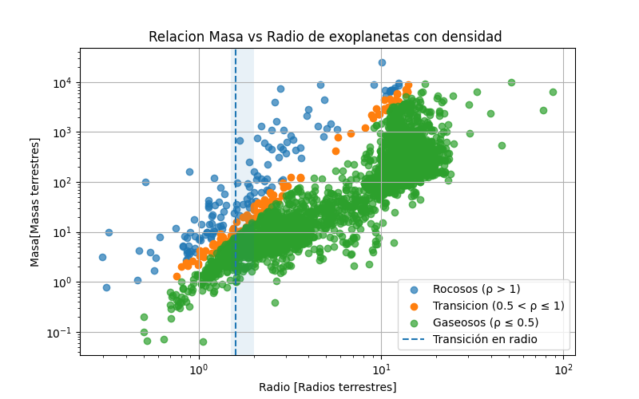

# Transicion_planetaria

La densidad, como una de las protagonistas de la fisica del medio continuo, puede ofrecer bastante informacion
para algunos modelos fisicos.

A partir de relacionar la masa y el radio de cada exoplaneta (asumiendo que estan en unidades canonicas = masa terrestre y radio terrestre)
junto con la suposicion de un volumen esferico para cada exoplaneta permitio obtener una densidad relativa para cada exoplaneta, tal que pudiesemos ver su distribucion por medio de una grafica log-log.

luego, se establecieron unos criterios de comparacion: 1. Densidades relativas superior a 1 implicaban que eran planetas tipo rocoso.
2. Densidades relativas entre 0.5 y 1 darian lugar a una zona de transicion (entre exoplanetas rocosos y gaseosos)
3. Densidades relativas menores a 0.5 corresponderian a exoplanetas gaseosos

Tras esto se tuvo en cuenta un limite (radios mayores o menores a 1.5 radios terrestres) como segundo criterio de dispersion de exoplanetas rocosos compactos y gigantes gaseosos esponjosos.

Es importante tener en cuenta que la particion de los exoplanetas se dio por lineas de densidad constante, por esto mismo se puede observar la distribucion de colores para los exoplanetas con lineas de densidad constante de la forma ax+b.

A medidad que aumenta el radio, se puede percibir una desviacion sistematica de la relacion Masa - Radio, la cual se podria explicar en exoplanetas que aumentan su tamano, pero no aumenta significativamente su densidad, lo que podria indicar el cambio a gigantes gaseosos. Es por esto que la transicion entre planetas rocosos y gaseosos no es una linea unica, es una zona continua donde se evidencia el cambio de la relacion Masa - Radio (con una pequena inflexion), un comportamiento monotono de la densidad y una cota por medio de las condiciones actuales que se tienen para separar aquellos planetas rocosos de gaseosos en funcion de su radio y densidad. 
